# 👥 Casos de Uso y Diagramas de Interacción - COE Aprobaciones

## Diagrama de Casos de Uso (Use Cases)

```mermaid
graph TB
    subgraph Users["👥 Usuarios"]
        Solicitante["👤 Solicitante"]
        Responsable["👨‍💼 Responsable"]
        Admin["👨‍💻 Admin"]
    end
    
    subgraph Authentication["🔐 Autenticación"]
        Login["Login"]
        Register["Registro"]
    end
    
    subgraph Solicitudes["📋 Gestión Solicitudes"]
        CreateRequest["Crear Solicitud"]
        ViewRequest["Ver Solicitud"]
        EditRequest["Editar Solicitud"]
        ApproveRequest["Aprobar Solicitud"]
        RejectRequest["Rechazar Solicitud"]
        DeleteRequest["Eliminar Solicitud"]
    end
    
    subgraph Notifications["📧 Notificaciones"]
        SendEmail["Enviar Email"]
        ViewNotifications["Ver Notificaciones"]
    end
    
    subgraph Reports["📊 Reportes"]
        ViewHistory["Ver Historial"]
        ViewStats["Ver Estadísticas"]
    end
    
    subgraph Admin_Ops["⚙️ Operaciones Admin"]
        ManageUsers["Gestionar Usuarios"]
        ManageTypes["Gestionar Tipos"]
    end
    
    Solicitante -->|usa| Login
    Solicitante -->|usa| Register
    Solicitante -->|usa| CreateRequest
    Solicitante -->|usa| ViewRequest
    Solicitante -->|usa| ViewNotifications
    Solicitante -->|usa| ViewHistory
    
    Responsable -->|usa| Login
    Responsable -->|usa| CreateRequest
    Responsable -->|usa| ViewRequest
    Responsable -->|usa| ApproveRequest
    Responsable -->|usa| RejectRequest
    Responsable -->|usa| ViewNotifications
    Responsable -->|usa| ViewHistory
    
    Admin -->|usa| Login
    Admin -->|usa| ManageUsers
    Admin -->|usa| ManageTypes
    Admin -->|usa| ViewHistory
    Admin -->|usa| ViewStats
    Admin -->|usa| DeleteRequest
    
    CreateRequest -->|genera| SendEmail
    ApproveRequest -->|genera| SendEmail
    RejectRequest -->|genera| SendEmail
    
    style Solicitante fill:#ffc107
    style Responsable fill:#17a2b8
    style Admin fill:#dc3545
```



---

## Historias de Usuario

### Historia 1: Crear y Aprobar Solicitud

**Como** Solicitante
**Quiero** Crear una solicitud de presupuesto
**Para** Obtener la aprobación del responsable

#### Criterios de Aceptación:
- ✅ Puedo acceder al formulario de nueva solicitud
- ✅ Puedo seleccionar un responsable de una lista
- ✅ Puedo escribir título y descripción
- ✅ Recibo confirmación cuando se crea
- ✅ El responsable recibe email automático
- ✅ La solicitud aparece en mi historial

#### Flujo Principal:
1. Hago clic en "Nueva Solicitud"
2. Completo el formulario
3. Selecciono responsable y tipo
4. Hago clic en "Crear"
5. Veo confirmación
6. Redirecciono a dashboard

#### Flujos Alternativos:
- **Si falta información:** Veo error de validación
- **Si el responsable no existe:** Veo error al guardar
- **Si hay error de red:** Reintento automáticamente

---

### Historia 2: Revisar y Aprobar Solicitud

**Como** Responsable
**Quiero** Revisar solicitudes pendientes
**Para** Aprobarlas o rechazarlas según corresponda

#### Criterios de Aceptación:
- ✅ Veo todas las solicitudes pendientes en dashboard
- ✅ Puedo hacer clic para ver detalles
- ✅ Puedo ver historial de cambios
- ✅ Puedo aprobar o rechazar
- ✅ Puedo agregar un comentario
- ✅ El solicitante recibe email

#### Flujo Principal:
1. Accedo a Dashboard
2. Filtro por "Pendientes"
3. Hago clic en una solicitud
4. Reviso detalles y comentarios
5. Hago clic en "Aprobar" o "Rechazar"
6. Agrego opcional un comentario
7. Confirmo la acción
8. Veo confirmación

#### Flujos Alternativos:
- **Si agrego comentario:** Se registra en historial
- **Si rechazo:** Debo proporcionar motivo

---

### Historia 3: Ver Notificaciones

**Como** Usuario
**Quiero** Ver todas mis notificaciones
**Para** Mantenerme informado de cambios

#### Criterios de Aceptación:
- ✅ Veo campana con contador de no leídas
- ✅ Puedo hacer clic para abrir bandeja
- ✅ Veo lista de todas las notificaciones
- ✅ Puedo marcar como leídas
- ✅ Puedo eliminar notificaciones
- ✅ Veo ordenadas por fecha descendente

#### Flujo Principal:
1. Hago clic en campana de notificaciones
2. Veo lista de notificaciones
3. Hago clic en una para leerla
4. Puedo marcar como leída
5. Puedo hacer clic para ir a la solicitud

---

### Historia 4: Gestionar Tipos de Solicitudes

**Como** Admin
**Quiero** Crear y editar tipos de solicitudes
**Para** Organizar las solicitudes por categoría

#### Criterios de Aceptación:
- ✅ Puedo listar todos los tipos
- ✅ Puedo crear nuevo tipo
- ✅ Puedo editar tipo existente
- ✅ Puedo eliminar tipo (si no tiene solicitudes)
- ✅ No puedo crear tipo con nombre duplicado

#### Flujo Principal:
1. Accedo a sección de administración
2. Selecciono "Gestionar Tipos"
3. Veo listado de tipos actuales
4. Hago clic en "Nuevo Tipo"
5. Completo nombre y descripción
6. Hago clic en "Guardar"
7. Veo confirmación

---

## Secuencias de Interacción

### Secuencia 1: Crear Solicitud

```
Solicitante        Frontend           Backend           Base de Datos         Email
    │                 │                 │                    │                  │
    │─ Click ────────→│                 │                    │                  │
    │ "Nueva Solitud" │                 │                    │                  │
    │                 │                 │                    │                  │
    │    ◄─ Form ────│                 │                    │                  │
    │                 │                 │                    │                  │
    │─ Completa ────→│                 │                    │                  │
    │ formulario      │                 │                    │                  │
    │                 │                 │                    │                  │
    │                 │─ POST /solicitudes ───→│             │                  │
    │                 │  (con datos)           │             │                  │
    │                 │                        │─ INSERT ──→│                  │
    │                 │                        │             │                  │
    │                 │                        │◄─ ID ─────│                  │
    │                 │                        │             │                  │
    │                 │                        │─ GET email ─→│                  │
    │                 │                        │  responsable  │                  │
    │                 │                        │◄─ email ────│                  │
    │                 │                        │             │                  │
    │                 │                        │─ INSERT notif ─→│              │
    │                 │                        │                 │              │
    │                 │                        │─ SEND EMAIL ───────────────→│
    │                 │                        │                 │          (async)│
    │                 │◄─ 201 Created ───────│                 │              │
    │                 │                        │                 │              │
    │◄─ Toast éxito ─│                 │                    │              │
    │   + redirect   │                 │                    │              │
    │                 │                 │                    │              │
    ✓ Fin            ✓                 ✓                    ✓              ✓
```

### Secuencia 2: Aprobar Solicitud

```
Responsable        Frontend           Backend           Base de Datos         Solicitante
    │                 │                 │                    │                  │
    │─ Click ────────→│                 │                    │                  │
    │ "Aprobar"       │                 │                    │                  │
    │                 │                 │                    │                  │
    │                 │─ PUT /solicitudes/:id/aprobar ────→││                  │
    │                 │     (usuario_id, comentario)        ││                  │
    │                 │                                     ││                  │
    │                 │                 ┌─UPDATE solicitud──→│                  │
    │                 │                 │  SET estado=apro.  │                  │
    │                 │                 │◄─ OK ─────────────│                  │
    │                 │                 │                    │                  │
    │                 │                 ├─INSERT historial──→│                  │
    │                 │                 │◄─ OK ─────────────│                  │
    │                 │                 │                    │                  │
    │                 │                 ├─GET email solici..→│                  │
    │                 │                 │◄─ email ──────────│                  │
    │                 │                 │                    │                  │
    │                 │                 ├─SEND EMAIL APRO.─────────────────→│
    │                 │                 │                    │            (async)│
    │                 │                 │                    │                  │
    │                 │◄─ 200 OK ──────│                    │                  │
    │                 │                 │                    │                  │
    │◄─ Toast éxito ─│                 │                    │                  │
    │   + reload     │                 │                    │                  │
    │                 │                 │                    │                  │
    ✓ Fin            ✓                 ✓                    ✓                  ✓
                                                                          (Email recibido)
```

---

## Matriz RACI Completa

```
╔════════════════════════════════════════════════════════════════════════╗
║                         MATRIZ RACI                                    ║
║ R = Responsible | A = Accountable | C = Consulted | I = Informed      ║
╠════════════════════════════════════════════════════════════════════════╣
║                                                                        ║
║ Actividad                │ Solicitante │ Responsable │ Admin │ Sistema║
║ ────────────────────────────────────────────────────────────────────  ║
║ Crear solicitud          │     R       │      I      │   C   │   A   ║
║ Revisar solicitud        │     I       │      R      │   C   │   A   ║
║ Aprobar solicitud        │     I       │      R      │   A   │   C   ║
║ Rechazar solicitud       │     I       │      R      │   A   │   C   ║
║ Registrar en historial   │     I       │      I      │   I   │   RA  ║
║ Enviar notificaciones    │     I       │      I      │   I   │   RA  ║
║ Gestionar usuarios       │     -       │      I      │  RA   │   C   ║
║ Gestionar tipos          │     -       │      I      │  RA   │   C   ║
║ Ver estadísticas         │     C       │      C      │  RA   │   I   ║
║ Backup de datos          │     -       │      -      │  RA   │   I   ║
║                                                                        ║
╚════════════════════════════════════════════════════════════════════════╝
```

---

## Estados y Transiciones Permitidas

```
┌──────────────────────────────────────────────────────┐
│           MÁQUINA DE ESTADOS                         │
│                                                      │
│   Estados: PENDIENTE → APROBADA                     │
│                    → RECHAZADA                      │
└──────────────────────────────────────────────────────┘

TRANSICIONES PERMITIDAS:

PENDIENTE:
  ✅ → APROBADA (solo Responsable o Admin)
  ✅ → RECHAZADA (solo Responsable o Admin)
  ✅ → PENDIENTE (editar si es autor)
  ❌ No se puede eliminar si tiene comentarios

APROBADA:
  ❌ No permite transiciones
  ✅ Solo lectura y comentarios
  ❌ No se puede revertir a PENDIENTE
  ✅ Solo Admin puede eliminar

RECHAZADA:
  ❌ No permite transiciones
  ✅ Solo lectura y comentarios
  ❌ No se puede revertir a PENDIENTE
  ✅ Solo Admin puede eliminar

PERMISOS POR ESTADO:

             PENDIENTE | APROBADA | RECHAZADA
  Crear           ✅        ❌         ❌
  Leer            ✅        ✅         ✅
  Editar (meta)   ✅        ❌         ❌
  Comentar        ✅        ✅         ✅
  Aprobar         ✅        ❌         ❌
  Rechazar        ✅        ❌         ❌
  Eliminar        ✅        ❌ (Admin) ❌ (Admin)
```

---

## Escenarios de Error y Manejo

### Escenario 1: Solicitud ya aprobada/rechazada

```
Usuario intenta aprobar una solicitud que ya fue procesada

┌─────────────────────────────────────┐
│ 1. Usuario carga solicitud          │
│    (Estado: APROBADA)               │
└────────────┬────────────────────────┘
             │
┌────────────▼────────────────────────┐
│ 2. Sistema muestra botón deshabilitado│
│    (Grayedout "Aprobar/Rechazar")   │
│    + Tooltip: "Ya procesada"         │
└────────────┬────────────────────────┘
             │
┌────────────▼────────────────────────┐
│ 3. Si intenta forzadamente via API   │
│    └─ Backend valida estado          │
│    └─ Retorna 409 Conflict           │
│    └─ Frontend muestra: "Ya procesada"│
└─────────────────────────────────────┘
```

### Escenario 2: Usuario no tiene permisos

```
Usuario sin rol de Responsable intenta aprobar

┌─────────────────────────────────────┐
│ 1. Usuario accede a solicitud       │
└────────────┬────────────────────────┘
             │
┌────────────▼────────────────────────┐
│ 2. Frontend revisa rol en useAuthStore
│    └─ Si no es Responsable/Admin    │
│    └─ Oculta botones de aprobación  │
│    └─ Muestra mensaje informativo   │
└────────────┬────────────────────────┘
             │
┌────────────▼────────────────────────┐
│ 3. Si intenta forzadamente via API   │
│    └─ Backend valida rol            │
│    └─ Retorna 403 Forbidden         │
│    └─ Frontend muestra: "Sin permisos"│
└─────────────────────────────────────┘
```

### Escenario 3: Error al enviar email

```
El sistema intenta enviar email pero falla

┌─────────────────────────────────────┐
│ 1. Solicitud se crea exitosamente   │
└────────────┬────────────────────────┘
             │
┌────────────▼────────────────────────┐
│ 2. Backend intenta enviar email     │
│    └─ nodemailer.sendMail() falla   │
│    └─ Error capturado en try-catch  │
└────────────┬────────────────────────┘
             │
┌────────────▼────────────────────────┐
│ 3. Respuestas:                      │
│    ✅ Frontend: 201 Created         │
│    ⚠️ Backend: log del error        │
│    📧 Email: no se envía            │
│    💾 BD: notificación registrada   │
│       (como no leída, para reintentar)
└─────────────────────────────────────┘

ACCIÓN CORRECTIVA:
- Admin puede reintentar envío manualmente
- Sistema log contiene detalles del error
- Solicitante ve en historial: "Email pendiente"
```

---

## Requisitos No Funcionales

```
┌─────────────────────────────────────────────────────────┐
│              REQUISITOS NO FUNCIONALES                  │
├─────────────────────────────────────────────────────────┤
│                                                         │
│ PERFORMANCE:                                            │
│ • Tiempo respuesta < 500ms (p95)                        │
│ • Carga de página < 3s                                  │
│ • 100+ usuarios simultáneos                             │
│                                                         │
│ DISPONIBILIDAD:                                         │
│ • Uptime 99.5% en producción                            │
│ • RTO (Recovery Time): 1 hora                           │
│ • RPO (Recovery Point): 15 minutos                      │
│                                                         │
│ ESCALABILIDAD:                                          │
│ • BD: hasta 1M de registros                             │
│ • Backend: horizontal scaling ready                     │
│ • Frontend: static asset caching                        │
│                                                         │
│ SEGURIDAD:                                              │
│ • Encriptación en tránsito (HTTPS)                      │
│ • Contraseñas hasheadas (bcrypt)                        │
│ • CSRF tokens (CSRF protection)                         │
│ • SQL injection prevention (prepared stmts)             │
│                                                         │
│ USABILIDAD:                                             │
│ • Interfaz intuitiva (Nielsen's 10 heuristics)          │
│ • Responsive design (mobile friendly)                   │
│ • Accesibilidad WCAG 2.1 AA                             │
│                                                         │
│ MANTENIBILIDAD:                                         │
│ • Código documentado                                    │
│ • Test coverage > 80%                                   │
│ • CI/CD pipeline automático                             │
│                                                         │
│ COMPATIBILIDAD:                                         │
│ • Navegadores: Chrome, Firefox, Safari, Edge           │
│ • Node.js: 16+                                          │
│ • PostgreSQL: 12+                                       │
│                                                         │
└─────────────────────────────────────────────────────────┘
```

---

## Dependencias Entre Funcionalidades

```
┌──────────────────────────────────────────────────────────┐
│          ÁRBOL DE DEPENDENCIAS                           │
└──────────────────────────────────────────────────────────┘

                  ┌─────────────────┐
                  │   Sistema Base  │
                  │ - Usuarios (BD) │
                  │ - Tipos (BD)    │
                  └────────┬────────┘
                           │
           ┌───────────────┼───────────────┐
           │               │               │
           ▼               ▼               ▼
      ┌──────────┐  ┌──────────┐  ┌──────────────┐
      │ Auth     │  │Solicitud │  │  Historial  │
      │- Login   │  │ - CRUD   │  │  - Tracking │
      │- Register│  │ - Crear  │  │  - Auditoria│
      └────┬─────┘  └────┬─────┘  └──────┬───────┘
           │             │               │
           └─────────────┼───────────────┘
                         │
                    ┌────▼─────┐
                    │Aprobación│
                    │- Aprobar │
                    │- Rechazar│
                    └────┬─────┘
                         │
           ┌─────────────┼─────────────┐
           │             │             │
           ▼             ▼             ▼
      ┌──────────┐ ┌──────────┐ ┌──────────────┐
      │  Email   │ │Notif DB  │ │   Notif UI  │
      │-Nodemailer─Guardar   │ │ - Toast      │
      │- Gmail   │ │- Registro│ │ - Bell icon  │
      └──────────┘ └──────────┘ └──────────────┘
```

---

## Matriz de Compatibilidad de Navegadores

| Característica | Chrome | Firefox | Safari | Edge | IE11 |
|----------------|--------|---------|--------|------|------|
| React 18 | ✅ | ✅ | ✅ | ✅ | ❌ |
| ES6+ | ✅ | ✅ | ✅ | ✅ | ❌ |
| Fetch API | ✅ | ✅ | ✅ | ✅ | ❌ |
| Crypto | ✅ | ✅ | ✅ | ✅ | ❌ |
| LocalStorage | ✅ | ✅ | ✅ | ✅ | ✅ |
| Responsive | ✅ | ✅ | ✅ | ✅ | ⚠️ |

---

**Última actualización:** 13 de enero de 2026
