# COE Aprobaciones - Documentación Completa

## Índice
1. [Diagramas de Arquitectura](#-diagramas-de-arquitectura) ⭐
2. [Descripción General](#descripción-general)
3. [Arquitectura del Proyecto](#arquitectura-del-proyecto)
4. [Backend](#backend)
5. [Frontend](#frontend)
6. [Base de Datos](#base-de-datos)
7. [Instalación y Configuración](#instalación-y-configuración)
8. [API Endpoints](#api-endpoints)
9. [Componentes y Servicios](#componentes-y-servicios)

---

## 📊 Diagramas de Arquitectura

### 1. Diagrama de Arquitectura General


### 2. Diagrama Entidad-Relación (ER)


### 3. Diagrama de Flujo - Autenticación

```mermaid
graph TD
    Start([Usuario accede a Login]) --> Enter["Ingresa correo<br/>y contraseña"]
    Enter --> Validate{Valida<br/>localmente}
    Validate -->|Error| ErrorLocal["❌ Muestra error"]
    ErrorLocal --> Enter
    Validate -->|OK| Post["POST /login<br/>con credenciales"]
    Post --> ServerCheck{Backend valida<br/>en BD}
    ServerCheck -->|No encontrado| Error404["❌ 404<br/>Usuario no encontrado"]
    ServerCheck -->|Credenciales incorrectas| Error404
    ServerCheck -->|OK| Success["✅ Usuario encontrado"]
    Success --> Store["Almacena en<br/>useAuthStore"]
    Store --> Redirect["Redirecciona a<br/>/dashboard"]
    Error404 --> Retry["Reintentar"]
    Retry --> Enter
    Redirect --> End([Sesión iniciada])
    
    style Start fill:#90c53f
    style End fill:#90c53f
    style Success fill:#28a745
    style Error404 fill:#dc3545
    style ErrorLocal fill:#ffc107
```



### 4. Diagrama de Flujo - Creación de Solicitud

```mermaid
graph TD
    Start([Usuario en Dashboard]) --> Click["Click en<br/>Nueva Solicitud"]
    Click --> Redirect["Redirecciona a<br/>/crear-solicitud"]
    Redirect --> Form["📋 Formulario:<br/>- Título<br/>- Descripción<br/>- Tipo<br/>- Responsable"]
    Form --> Fill["Usuario completa<br/>formulario"]
    Fill --> Validate{Valida<br/>campos}
    Validate -->|Error| Error["❌ Muestra<br/>validación"]
    Error --> Fill
    Validate -->|OK| Post["POST /solicitudes<br/>con datos"]
    Post --> Insert["Backend: INSERT<br/>en tabla"]
    Insert --> GetInfo["Obtiene email<br/>del responsable"]
    GetInfo --> SendEmail["📧 Envía correo<br/>de notificación"]
    SendEmail --> SaveDB["Registra<br/>notificación en BD"]
    SaveDB --> Response["✅ 201 Created<br/>Retorna ID"]
    Response --> Toast["Muestra toast<br/>de éxito"]
    Toast --> RedirectDash["Redirecciona a<br/>/dashboard"]
    RedirectDash --> End([Solicitud creada])
    
    style Start fill:#90c53f
    style End fill:#90c53f
    style SendEmail fill:#d5221e
    style Response fill:#28a745
    style Error fill:#dc3545
```



### 5. Diagrama de Flujo - Aprobación de Solicitud

```mermaid
graph TD
    Start([Responsable en Dashboard]) --> View["Click en<br/>solicitud pendiente"]
    View --> Detail["Redirecciona a<br/>/solicitudes/:id"]
    Detail --> Display["📄 Muestra:<br/>- Detalles<br/>- Historial<br/>- Comentarios"]
    Display --> Review["Responsable<br/>revisa datos"]
    Review --> Decision{Toma<br/>decisión}
    
    Decision -->|Aprobar| Approve["Click en Aprobar"]
    Decision -->|Rechazar| Reject["Click en Rechazar"]
    Decision -->|Comentar| Comment["Agrega comentario"]
    
    Comment --> Review
    
    Approve --> Optional1["Opcionalmente:<br/>agrega comentario"]
    Optional1 --> PutApprove["PUT /solicitudes/:id/aprobar"]
    PutApprove --> UpdateDB1["UPDATE estado<br/>a APROBADA"]
    UpdateDB1 --> InsertHistory1["INSERT en historial"]
    InsertHistory1 --> SendEmail1["📧 Envía correo<br/>al solicitante"]
    SendEmail1 --> Response1["✅ 200 OK"]
    Response1 --> Toast1["Toast: Aprobada"]
    
    Reject --> Optional2["Ingresa motivo<br/>de rechazo"]
    Optional2 --> PutReject["PUT /solicitudes/:id/rechazar"]
    PutReject --> UpdateDB2["UPDATE estado<br/>a RECHAZADA"]
    UpdateDB2 --> InsertHistory2["INSERT en historial<br/>+ motivo"]
    InsertHistory2 --> SendEmail2["📧 Envía correo<br/>al solicitante"]
    SendEmail2 --> Response2["✅ 200 OK"]
    Response2 --> Toast2["Toast: Rechazada"]
    
    Toast1 --> RefreshDash1["Recarga dashboard"]
    Toast2 --> RefreshDash2["Recarga dashboard"]
    RefreshDash1 --> End([Solicitud procesada])
    RefreshDash2 --> End
    
    style Start fill:#90c53f
    style End fill:#90c53f
    style PutApprove fill:#28a745
    style PutReject fill:#dc3545
    style SendEmail1 fill:#d5221e
    style SendEmail2 fill:#d5221e
```



### 6. Diagrama de Estado de Solicitudes


### 7. Diagrama de Flujo de Datos - Notificaciones


    end
    
    subgraph Services["Servicios API"]
        AuthSvc["usuariosService.js"]
        SolicSvc["solicitudesService.js"]
        TipoSvc["tiposService.js"]
        NotifSvc["notificacionesService.js"]
        HistSvc["historialService.js"]
        ApiSvc["api.js (Axios)"]
    end
    
    subgraph Store["Estado Global (Zustand)"]
        AuthStore["useAuthStore"]
        SolicStore["useSolicitudStore"]
        ToastStore["useToastStore"]
    end
    
    Login -->|usuario| AuthStore
    Create -->|nueva solicitud| SolicStore
    Dashboard -->|lista solicitudes| SolicStore
    Detail -->|detalles| SolicStore
    
    AuthSvc -->|HTTP| ApiSvc
    SolicSvc -->|HTTP| ApiSvc
    TipoSvc -->|HTTP| ApiSvc
    NotifSvc -->|HTTP| ApiSvc
    HistSvc -->|HTTP| ApiSvc
    
    Container -->|muestra| Toast
    Dashboard -->|usa| Bell
    Detail -->|usa| Badge
    
    style App fill:#61dafb
    style Components fill:#87ceeb
    style Services fill:#90c53f
    style Store fill:#ffc107
```

### 9. Diagrama de Flujo - Recuperación de Datos

```mermaid
graph TB
    Client["🖥️ Cliente React"]
    
    Client -->|1. GET /solicitudes| Backend["🖧 Backend Express"]
    Backend -->|2. Query| DB["📦 PostgreSQL"]
    DB -->|3. Result Set| Backend
    Backend -->|4. Transformación<br/>Mapeo de datos| Transform["Agregar info usuario<br/>solicitante/responsable"]
    Transform -->|5. JSON Response| Client
    Client -->|6. Almacena| Store["Zustand Store"]
    Store -->|7. Renderiza| UI["React Components"]
    
    style Client fill:#61dafb
    style Backend fill:#90c53f
    style DB fill:#336791
    style Store fill:#ffc107
    style UI fill:#87ceeb
```



### 10. Diagrama de Seguridad y Validación


### 11. Diagrama de Ciclo de Vida - Solicitud

```mermaid
timeline
    title Ciclo de Vida de una Solicitud
    
    section Creación
    Solicitante crea solicitud : se registra con estado PENDIENTE
    Sistema envía email : al responsable asignado
    
    section Revisión
    Responsable revisa : accede al detalle
    Responsable decide : aprobar o rechazar
    
    section Aprobación
    Si es aprobado : estado = APROBADA
    Se registra en historial : con timestamp
    Email al solicitante : notificación de aprobación
    
    section Rechazo (Alternativa)
    Si es rechazado : estado = RECHAZADA
    Se registra motivo : en campo motivo_rechazo
    Email al solicitante : con motivo incluido
    
    section Cierre
    Solicitud finalizada : no se puede revertir
    Historial completo : visible para auditoría
```



### 12. Diagrama de Roles y Permisos

```mermaid
graph TD
    subgraph Roles["Roles de Usuario"]
        Solicitante["👤 SOLICITANTE"]
        Responsable["👨‍💼 RESPONSABLE"]
        Admin["👨‍💻 ADMIN"]
    end
    
    subgraph SolicActions["Acciones Solicitud"]
        Create["Crear solicitud"]
        View["Ver propia"]
        ViewAll["Ver todas"]
        Approve["Aprobar/Rechazar"]
        Delete["Eliminar"]
    end
    
    subgraph UserMgmt["Gestión Usuarios"]
        ListUsers["Listar usuarios"]
        UpdateUser["Editar usuario"]
        DeleteUser["Eliminar usuario"]
    end
    
    subgraph TypeMgmt["Gestión Tipos"]
        ViewType["Ver tipos"]
        CreateType["Crear tipo"]
        UpdateType["Editar tipo"]
        DeleteType["Eliminar tipo"]
    end
    
    Solicitante -->|✅| Create
    Solicitante -->|✅| View
    Solicitante -->|❌| ViewAll
    Solicitante -->|❌| Approve
    
    Responsable -->|✅| Create
    Responsable -->|✅| View
    Responsable -->|✅| ViewAll
    Responsable -->|✅| Approve
    Responsable -->|❌| Delete
    
    Admin -->|✅| Create
    Admin -->|✅| ViewAll
    Admin -->|✅| Approve
    Admin -->|✅| Delete
    Admin -->|✅| ListUsers
    Admin -->|✅| UpdateUser
    Admin -->|✅| DeleteUser
    Admin -->|✅| ViewType
    Admin -->|✅| CreateType
    Admin -->|✅| UpdateType
    Admin -->|✅| DeleteType
    
    style Solicitante fill:#ffc107
    style Responsable fill:#17a2b8
    style Admin fill:#dc3545
```



### 13. Diagrama de Flujo - Envío de Correos

```mermaid
graph TD
    subgraph Triggers["Disparadores"]
        T1["Nueva Solicitud"]
        T2["Solicitud Aprobada"]
        T3["Solicitud Rechazada"]
    end
    
    subgraph EmailFunctions["Funciones Email"]
        F1["enviarNotificacionNuevaSolicitud"]
        F2["enviarNotificacionAprobada"]
        F3["enviarNotificacionRechazada"]
    end
    
    subgraph Content["Contenido Email"]
        C1["Template HTML:<br/>Saludo<br/>Detalles solicitud<br/>Llamada a acción"]
        C2["Template HTML:<br/>Confirmación aprobación<br/>Datos relevantes"]
        C3["Template HTML:<br/>Notificación rechazo<br/>Motivo"]
    end
    
    subgraph Delivery["Entrega"]
        D["Nodemailer<br/>SMTP Gmail<br/>transporter.sendMail"]
    end
    
    subgraph Storage["Almacenamiento"]
        S["INSERT en tabla<br/>notificaciones"]
    end
    
    subgraph User["Usuario Final"]
        U["📧 Recibe email<br/>en inbox"]
    end
    
    T1 --> F1
    T2 --> F2
    T3 --> F3
    
    F1 --> C1
    F2 --> C2
    F3 --> C3
    
    C1 --> D
    C2 --> D
    C3 --> D
    
    D -->|sendMail| U
    D -->|INSERT| S
    
    style D fill:#d5221e
    style U fill:#90c53f
    style S fill:#336791
```



### 14. Diagrama de Consistencia de Datos

```mermaid
graph TD
    subgraph "Integridad Referencial"
        FK1["solicitud_id → solicitudes"]
        FK2["usuario_id → usuarios"]
        FK3["tipo_id → tipos"]
    end
    
    subgraph "Relaciones Garantizadas"
        R1["Toda solicitud tiene solicitante<br/>(FK usuarios)"]
        R2["Toda solicitud tiene responsable<br/>(FK usuarios)"]
        R3["Toda solicitud tiene tipo<br/>(FK tipos)"]
        R4["Todo historial tiene solicitud<br/>(FK solicitudes)"]
        R5["Todo historial tiene usuario<br/>(FK usuarios)"]
    end
    
    subgraph "Cascadas"
        C1["Eliminar usuario → Elimina sus solicitudes"]
        C2["Eliminar usuario → Elimina su historial"]
        C3["Eliminar solicitud → Elimina historial"]
        C4["Eliminar solicitud → Elimina comentarios"]
    end
    
    FK1 --> R1
    FK2 --> R2
    FK3 --> R3
    R1 --> C1
    R2 --> C1
    R4 --> C3
    R5 --> C2
    
    style R1 fill:#28a745
    style R2 fill:#28a745
    style R3 fill:#28a745
    style C1 fill:#ffc107
    style C3 fill:#ffc107
```



### 15. Stack Tecnológico - Diagrama Jerárquico


---

## 📊 Tablas Comparativas y Análisis

### Tabla 1: Endpoints por Recurso

| Recurso | GET | POST | PUT | DELETE | Total |
|---------|-----|------|-----|--------|-------|
| **Usuarios** | 2 (lista, uno) | 2 (login, registro) | 1 (actualizar) | 1 (eliminar) | **6** |
| **Solicitudes** | 2 (lista, uno) | 1 (crear) | 3 (editar, aprobar, rechazar) | 1 (eliminar) | **7** |
| **Tipos** | 2 (lista, uno) | 1 (crear) | 1 (actualizar) | 1 (eliminar) | **5** |
| **Notificaciones** | 1 (bandeja) | 1 (enviar) | - | - | **2** |
| **Historial** | 2 (global, por solicitud) | - | - | - | **2** |
| **TOTAL** | **9** | **5** | **5** | **3** | **22** |

### Tabla 2: Entidades - Características Principales

| Entidad | Registros Esperados | Crecimiento | PK Type | FK Count | Índices |
|---------|-------------------|------------|---------|---------|---------|
| **usuarios** | 50-500 | Lento | UUID | 0 | 0 |
| **tipos** | 5-20 | Muy lento | UUID | 0 | 0 |
| **solicitudes** | 100-10000 | Medio-Rápido | UUID | 3 | 4 |
| **historial** | 500-50000 | Rápido | UUID | 2 | 2 |
| **comentarios** | 1000-100000 | Muy rápido | UUID | 2 | 2 |
| **notificaciones** | 1000-100000 | Muy rápido | UUID | 2 | 2 |

### Tabla 3: Flujos Principales

| Flujo | Entrada | Procesos | Salida | Notificaciones |
|-------|---------|----------|--------|-----------------|
| **Login** | Correo + Contraseña | 1. Validar<br/>2. Query BD<br/>3. Retornar usuario | Usuario DTO | Ninguna |
| **Crear Solicitud** | Datos solicitud | 1. Validar<br/>2. INSERT<br/>3. Get responsable<br/>4. Enviar email<br/>5. Guardar notif | Solicitud creada | Email responsable |
| **Aprobar** | ID + Comentario | 1. Validar<br/>2. UPDATE estado<br/>3. INSERT historial<br/>4. Enviar email | Solicitud aprobada | Email solicitante |
| **Rechazar** | ID + Motivo | 1. Validar<br/>2. UPDATE estado<br/>3. INSERT historial<br/>4. Enviar email | Solicitud rechazada | Email solicitante |
| **Ver Historial** | ID Solicitud | 1. Query<br/>2. Order by fecha | Array historial | Ninguna |

### Tabla 4: Índices de Base de Datos

| Tabla | Campo Indexado | Tipo | Justificación |
|-------|-----------------|------|----------------|
| **solicitudes** | solicitante_id | FK | Filtrar por quien crea |
| **solicitudes** | responsable_id | FK | Filtrar por responsable |
| **solicitudes** | tipo | FK | Filtrar por tipo |
| **solicitudes** | estado | Regular | Filtrar por pendiente/aprobada/rechazada |
| **historial** | solicitud_id | FK | Obtener historial de una solicitud |
| **historial** | usuario_id | FK | Obtener acciones de un usuario |
| **comentarios** | solicitud_id | FK | Obtener comentarios de solicitud |
| **comentarios** | usuario_id | FK | Obtener comentarios de usuario |
| **notificaciones** | usuario_id | FK | Bandeja del usuario |
| **notificaciones** | solicitud_id | FK | Notificaciones de una solicitud |

### Tabla 5: Comparativa de Roles y Permisos

| Acción | Solicitante | Responsable | Admin |
|--------|-----------|------------|-------|
| Crear solicitud | ✅ | ✅ | ✅ |
| Ver propias solicitudes | ✅ | ✅ | ✅ |
| Ver todas las solicitudes | ❌ | ✅ | ✅ |
| Aprobar/Rechazar | ❌ | ✅ | ✅ |
| Eliminar solicitud | ❌ | ❌ | ✅ |
| Gestionar usuarios | ❌ | ❌ | ✅ |
| Gestionar tipos | ❌ | ❌ | ✅ |
| Ver historial global | ❌ | ✅ | ✅ |
| Ver notificaciones | ✅ | ✅ | ✅ |

---

## Descripción General

**COE Aprobaciones** es una plataforma web completa para gestionar solicitudes de aprobación. Permite a los usuarios:
- Crear solicitudes de aprobación
- Asignar responsables para revisar
- Aprobar o rechazar solicitudes
- Mantener un historial de cambios
- Recibir notificaciones por correo electrónico
- Gestionar usuarios y tipos de solicitudes

**Stack Tecnológico:**
- **Backend:** Node.js + Express.js
- **Frontend:** React 18 + Vite + Zustand + TailwindCSS
- **Base de Datos:** PostgreSQL
- **Comunicación:** REST API + CORS
- **Notificaciones:** Nodemailer (Gmail)

---

## Arquitectura del Proyecto

```
coe-aprobaciones/
├── backend/           # Servidor Express.js
│   ├── src/
│   │   ├── controllers/    # Lógica de negocio
│   │   ├── routes/         # Definición de rutas
│   │   ├── services/       # Servicios (email, etc.)
│   │   ├── db.js          # Configuración de conexión PostgreSQL
│   │   └── index.js       # Punto de entrada del servidor
│   ├── .env            # Variables de entorno
│   └── package.json    # Dependencias
├── frontend/          # Aplicación React
│   ├── src/
│   │   ├── components/     # Componentes reutilizables
│   │   ├── pages/          # Páginas principales
│   │   ├── services/       # Servicios API
│   │   ├── store/          # Estado global (Zustand)
│   │   ├── App.jsx        # Componente principal
│   │   └── main.jsx       # Punto de entrada
│   ├── .env            # Variables de entorno
│   └── package.json    # Dependencias
└── infra/             # Infraestructura
    ├── docker/         # Dockerfiles y docker-compose
    └── aws/            # Documentación AWS
```

---

## Backend

### Configuración (`src/db.js`)

Gestiona la conexión a PostgreSQL usando el pool de conexiones.

```javascript
Pool Configuration:
- User: DB_USER (variable de entorno)
- Password: DB_PASSWORD (variable de entorno)
- Host: DB_HOST (variable de entorno)
- Port: 5432 (por defecto)
- Database: DB_NAME (variable de entorno)
- SSL: Configurable via DB_SSL
- Max connections: 20
- Idle timeout: 30000ms
- Connection timeout: 2000ms
```

**Variables de entorno requeridas:**
```
DB_USER=usuario
DB_PASSWORD=contraseña
DB_HOST=localhost
DB_PORT=5432
DB_NAME=coe_aprobaciones
DB_SSL=false
```

### Punto de Entrada (`src/index.js`)

Servidor Express configurado con:
- **CORS:** Permite peticiones desde localhost:5173 y localhost:3000
- **Middleware:** express.json() para parsear JSON
- **Health Check:** Endpoint GET `/health`
- **Puerto:** 8080 (configurable)

**Variables de entorno:**
```
PORT=8080
NODE_ENV=development
```

### Controladores

#### `usuarios.controllers.js`

Gestiona operaciones CRUD de usuarios.

| Función | Descripción | Parámetros |
|---------|-------------|-----------|
| `listarUsuarios()` | Obtiene todos los usuarios | GET `/usuarios` |
| `iniciarUsuario()` | Valida credenciales y autentica | POST `/login` con `correo`, `contrasena` |
| `crearUsuario()` | Registra un nuevo usuario | POST `/registro` con `nombre`, `correo`, `rol`, `contrasena` |
| `detalleUsuario()` | Obtiene datos de un usuario específico | GET `/usuarios/:id` |
| `actualizarUsuario()` | Actualiza datos del usuario | PUT `/usuarios/:id` con `nombre`, `correo`, `rol` |
| `eliminarUsuario()` | Elimina un usuario | DELETE `/usuarios/:id` |

**Estructura de Usuario:**
```json
{
  "id": "uuid",
  "nombre": "string",
  "correo": "email",
  "rol": "solicitante|responsable|admin",
  "contrasena": "string (hasheada en producción)",
  "creado_en": "timestamp"
}
```

#### `solicitudes.controllers.js`

Gestiona solicitudes de aprobación con notificaciones por correo.

| Función | Descripción |
|---------|-------------|
| `listarSolicitudes()` | Lista todas las solicitudes con info de solicitante, responsable y tipo |
| `obtenerSolicitud()` | Obtiene detalle completo de una solicitud |
| `crearSolicitud()` | Crea nueva solicitud y envía correo al responsable |
| `actualizarSolicitud()` | Actualiza datos de la solicitud |
| `aprobarSolicitud()` | Aprueba solicitud, registra en historial y envía correo |
| `rechazarSolicitud()` | Rechaza solicitud con motivo y envía correo |
| `eliminarSolicitud()` | Elimina una solicitud |
| `obtenerHistorial()` | Obtiene historial de cambios de una solicitud |

**Estructura de Solicitud:**
```json
{
  "id": "uuid",
  "titulo": "string",
  "descripcion": "string",
  "estado": "pendiente|aprobada|rechazada",
  "solicitante_id": "uuid",
  "responsable_id": "uuid",
  "tipo": "uuid",
  "motivo_rechazo": "string (opcional)",
  "fecha_creacion": "timestamp",
  "fecha_aprobacion": "timestamp",
  "fecha_rechazo": "timestamp",
  "solicitante": { "id", "nombre", "correo", "rol" },
  "responsable": { "id", "nombre", "correo", "rol" },
  "tipo_nombre": "string"
}
```

**Validaciones:**
- Todos los campos requeridos deben estar presentes
- Se valida la existencia de solicitante, responsable y tipo
- Envío automático de correos en cambios de estado

#### `tipos.controllers.js`

Gestiona los tipos de solicitudes disponibles.

| Función | Descripción |
|---------|-------------|
| `listarTipos()` | Obtiene todos los tipos ordenados alfabéticamente |
| `obtenerTipo()` | Obtiene un tipo específico |
| `crearTipo()` | Crea un nuevo tipo |
| `actualizarTipo()` | Actualiza un tipo |
| `eliminarTipo()` | Elimina un tipo |

**Estructura de Tipo:**
```json
{
  "id": "uuid",
  "nombre": "string (único)",
  "descripcion": "string (opcional)",
  "creado_en": "timestamp"
}
```

#### `notificaciones.controllers.js`

Gestiona notificaciones y envío de correos.

| Función | Descripción |
|---------|-------------|
| `enviarCorreo()` | Envía correo personalizado y registra en BD |
| `bandejaUsuario()` | Obtiene notificaciones de un usuario |

**Request para enviarCorreo:**
```json
{
  "destinatario": "email@example.com",
  "asunto": "string",
  "cuerpo": "string (HTML permitido)",
  "usuario_id": "uuid",
  "solicitud_id": "uuid (opcional)"
}
```

**Validaciones:**
- Email válido requerido
- Usuario debe existir en BD
- Respuesta con ID de notificación registrada

#### `historial.controllers.js`

Gestiona el historial de cambios de solicitudes.

| Función | Descripción |
|---------|-------------|
| `historialPorSolicitud()` | Obtiene historial de una solicitud específica |
| `historialGlobal()` | Obtiene historial completo del sistema |

**Estructura de Historial:**
```json
{
  "id": "uuid",
  "solicitud_id": "uuid",
  "usuario_id": "uuid",
  "accion": "crear|aprobar|rechazar|comentar",
  "comentario": "string (opcional)",
  "fecha_creacion": "timestamp"
}
```

### Servicios

#### `emailService.js`

Servicio de notificaciones por correo usando Nodemailer.

**Funciones:**

1. **`enviarNotificacionNuevaSolicitud()`**
   - Se dispara cuando se crea una nueva solicitud
   - Notifica al responsable asignado
   - Parámetros: destinatario, nombreResponsable, titulo, nombreSolicitante, solicitudId

2. **`enviarNotificacionAprobada()`**
   - Se dispara cuando una solicitud es aprobada
   - Notifica al solicitante
   - Parámetros: destinatario, nombreSolicitante, titulo, nombreResponsable, comentario

3. **`enviarNotificacionRechazada()`**
   - Se dispara cuando una solicitud es rechazada
   - Notifica al solicitante con motivo del rechazo
   - Parámetros: destinatario, nombreSolicitante, titulo, nombreResponsable, motivo

**Configuración requerida:**
```
EMAIL_USER=tu-email@gmail.com
EMAIL_PASSWORD=tu-contraseña-app (no la contraseña normal)
```

**Nota:** Para Gmail, usar contraseña de aplicación específica (generar en Google Account Security).

### Rutas

#### `usuarios.routes.js`
```
GET  /usuarios              → listarUsuarios
POST /login                 → iniciarUsuario
POST /registro              → crearUsuario
GET  /usuarios/:id          → detalleUsuario
PUT  /usuarios/:id          → actualizarUsuario
DELETE /usuarios/:id        → eliminarUsuario
```

#### `solicitudes.routes.js`
```
GET    /solicitudes                 → listarSolicitudes
POST   /solicitudes                 → crearSolicitud
GET    /solicitudes/:id             → obtenerSolicitud
PUT    /solicitudes/:id             → actualizarSolicitud
DELETE /solicitudes/:id             → eliminarSolicitud
PUT    /solicitudes/:id/aprobar     → aprobarSolicitud
PUT    /solicitudes/:id/rechazar    → rechazarSolicitud
GET    /solicitudes/:id/historial   → obtenerHistorial
```

#### `tipos.routes.js`
```
GET    /tipos                       → listarTipos
POST   /tipos                       → crearTipo
GET    /tipos/:id                   → obtenerTipo
PUT    /tipos/:id                   → actualizarTipo
DELETE /tipos/:id                   → eliminarTipo
```

#### `notificaciones.routes.js`
```
POST   /correos                     → enviarCorreo
GET    /notificaciones/:usuario_id  → bandejaUsuario
```

#### `historial.routes.js`
```
GET    /historial/:id               → historialPorSolicitud
GET    /historial                   → historialGlobal
```

---

## Frontend

### Configuración

**`vite.config.js`** - Configuración de Vite
- Server proxy para desarrollo
- Plugin React habilitado
- Build optimizado

**`tailwind.config.js`** - Configuración de TailwindCSS
- Personalización de temas
- Extensión de colores

**`.env`** - Variables de entorno
```
VITE_API_URL=http://localhost:8080
```

### Estructura de Carpetas

#### `services/` - Servicios API

**`api.js`** - Cliente HTTP base
- Instancia de Axios configurada
- Base URL desde variables de entorno
- Manejo de errores centralizado

**`usuariosService.js`**
```javascript
- login(correo, contrasena)        → POST /login
- registro(datos)                  → POST /registro
- obtenerUsuario(id)               → GET /usuarios/:id
- listarUsuarios()                 → GET /usuarios
- actualizarUsuario(id, datos)     → PUT /usuarios/:id
```

**`solicitudesService.js`**
```javascript
- listarSolicitudes()              → GET /solicitudes
- obtenerSolicitud(id)             → GET /solicitudes/:id
- crearSolicitud(datos)            → POST /solicitudes
- actualizarSolicitud(id, datos)   → PUT /solicitudes/:id
- aprobarSolicitud(id, comentario) → PUT /solicitudes/:id/aprobar
- rechazarSolicitud(id, motivo)    → PUT /solicitudes/:id/rechazar
- eliminarSolicitud(id)            → DELETE /solicitudes/:id
```

**`tiposService.js`**
```javascript
- listarTipos()                    → GET /tipos
- obtenerTipo(id)                  → GET /tipos/:id
- crearTipo(datos)                 → POST /tipos
- actualizarTipo(id, datos)        → PUT /tipos/:id
- eliminarTipo(id)                 → DELETE /tipos/:id
```

**`notificacionesService.js`**
```javascript
- obtenerNotificaciones(usuarioId) → GET /notificaciones/:usuario_id
- enviarCorreo(datos)              → POST /correos
```

**`historialService.js`**
```javascript
- obtenerHistorial(solicitudId)    → GET /solicitudes/:id/historial
- obtenerHistorialGlobal()         → GET /historial
```

#### `store/` - Estado Global (Zustand)

**`useAuthStore.js`** - Gestión de autenticación
```javascript
Estado:
- usuario: objeto del usuario logueado
- isAuthenticated: booleano
- token: token JWT (si se implementa)

Acciones:
- login(correo, contrasena)
- logout()
- setUsuario(usuario)
```

**`useSolicitudStore.js`** - Gestión de solicitudes
```javascript
Estado:
- solicitudes: array de solicitudes
- solicitudActual: solicitud seleccionada
- historial: historial de cambios
- loading: estado de carga

Acciones:
- setSolicitudes(solicitudes)
- setSolicitudActual(solicitud)
- setHistorial(historial)
- agregarSolicitud(solicitud)
- actualizarSolicitud(solicitud)
```

**`useToastStore.js`** - Gestión de notificaciones UI
```javascript
Estado:
- toasts: array de notificaciones

Acciones:
- agregarToast(mensaje, tipo)
- eliminarToast(id)
```

#### `components/` - Componentes Reutilizables

**`Toast.jsx`** - Notificación individual
- Props: `id`, `mensaje`, `tipo` (success, error, info, warning)
- Auto-desaparición en 3 segundos
- Iconos según el tipo

**`ToastContainer.jsx`** - Contenedor de notificaciones
- Renderiza múltiples Toast
- Utiliza `useToastStore`
- Posicionado fixed en la esquina superior derecha

**`NotificationBell.jsx`** - Campana de notificaciones
- Muestra cantidad de notificaciones no leídas
- Dropdown con últimas notificaciones
- Click para ir a página de notificaciones

**`Badge.jsx`** - Etiqueta de estado
- Props: `estado`, `children`
- Colores según estado (pendiente, aprobada, rechazada)
- Componente reutilizable en listados

#### `pages/` - Páginas Principales

**`Login.jsx`** - Página de autenticación
- Formulario con correo y contraseña
- Validaciones de entrada
- Redirección a Dashboard si está autenticado
- Link a Registro

**`Registro.jsx`** - Página de registro
- Formulario con nombre, correo, rol, contraseña
- Selección de rol (solicitante, responsable, admin)
- Validaciones de email único
- Redirección a Login después de registro exitoso

**`Dashboard.jsx`** - Panel principal
- Listado de solicitudes
- Filtros por estado
- Búsqueda por título
- Tabla con acciones (ver, editar, aprobar, rechazar)
- Botón para crear nueva solicitud
- Indicadores de estadísticas

**`CrearSolicitud.jsx`** - Formulario de nueva solicitud
- Campos: título, descripción, tipo, responsable asignado
- Selector de responsables (lista de usuarios)
- Validaciones requeridas
- Preview de datos antes de crear
- Redirección a Dashboard después de creación

**`DetalleSolicitud.jsx`** - Vista detallada de solicitud
- Información completa de la solicitud
- Historial de cambios
- Sección de comentarios
- Acciones (aprobar/rechazar) si es responsable
- Notificaciones en tiempo real

**`Notificaciones.jsx`** - Centro de notificaciones
- Listado de todas las notificaciones del usuario
- Filtros por tipo (correo, sistema)
- Búsqueda
- Marcar como leídas
- Eliminar notificaciones

### App.jsx - Router Principal

Define las rutas de la aplicación:
```
/login              → Login
/registro           → Registro
/dashboard          → Dashboard
/crear-solicitud    → CrearSolicitud
/solicitudes/:id    → DetalleSolicitud
/notificaciones     → Notificaciones
/                   → Redirección a /login
```

---

## Base de Datos

### Diagrama de Relaciones

```
usuarios ←─┐
           ├─ solicitudes ─┬─ historial
           │               ├─ comentarios
           ├─ historial    └─ notificaciones
           └─ notificaciones

tipos ─────┬─ solicitudes
```

### Tablas

#### `usuarios`
```sql
id          UUID PRIMARY KEY
nombre      VARCHAR(120) NOT NULL
correo      VARCHAR(160) UNIQUE NOT NULL
contrasena  VARCHAR(255) NOT NULL
rol         VARCHAR(40) NOT NULL  -- solicitante, responsable, admin
creado_en   TIMESTAMP DEFAULT NOW()
```

**Índices:** Ninguno (optimizables por correo)

#### `tipos`
```sql
id          UUID PRIMARY KEY
nombre      VARCHAR(60) NOT NULL UNIQUE
descripcion TEXT
creado_en   TIMESTAMP DEFAULT NOW()
```

#### `solicitudes`
```sql
id                  UUID PRIMARY KEY
titulo              VARCHAR(160) NOT NULL
descripcion         TEXT NOT NULL
solicitante_id      UUID NOT NULL FK → usuarios
responsable_id      UUID NOT NULL FK → usuarios
tipo                UUID NOT NULL FK → tipos
estado              VARCHAR(20) DEFAULT 'pendiente'
motivo_rechazo      TEXT
fecha_creacion      TIMESTAMP DEFAULT NOW()
fecha_aprobacion    TIMESTAMP
fecha_rechazo       TIMESTAMP
```

**Índices:**
- `idx_solicitudes_solicitante` en solicitante_id
- `idx_solicitudes_responsable` en responsable_id
- `idx_solicitudes_tipo` en tipo
- `idx_solicitudes_estado` en estado

#### `historial`
```sql
id              UUID PRIMARY KEY
solicitud_id    UUID NOT NULL FK → solicitudes
usuario_id      UUID NOT NULL FK → usuarios
accion          VARCHAR(50) NOT NULL
comentario      TEXT
fecha_creacion  TIMESTAMP DEFAULT NOW()
```

**Índices:**
- `idx_historial_solicitud` en solicitud_id
- `idx_historial_usuario` en usuario_id

#### `comentarios`
```sql
id              UUID PRIMARY KEY
solicitud_id    UUID NOT NULL FK → solicitudes
usuario_id      UUID NOT NULL FK → usuarios
contenido       TEXT NOT NULL
fecha_creacion  TIMESTAMP DEFAULT NOW()
```

**Índices:**
- `idx_comentarios_solicitud` en solicitud_id
- `idx_comentarios_usuario` en usuario_id

#### `notificaciones`
```sql
id              UUID PRIMARY KEY
usuario_id      UUID NOT NULL FK → usuarios
solicitud_id    UUID FK → solicitudes
asunto          VARCHAR(160) NOT NULL
cuerpo          TEXT NOT NULL
fecha_envio     TIMESTAMP DEFAULT NOW()
leida           BOOLEAN DEFAULT FALSE
```

**Índices:**
- `idx_notificaciones_usuario` en usuario_id
- `idx_notificaciones_solicitud` en solicitud_id

---

## Instalación y Configuración

### Requisitos Previos
- Node.js 16+
- npm o yarn
- PostgreSQL 12+
- Git

### Instalación Local

#### 1. Clonar repositorio
```bash
git clone <repo-url>
cd coe-aprobaciones
```

#### 2. Configurar Base de Datos
```bash
# Crear base de datos
createdb coe_aprobaciones

# Ejecutar migraciones
psql coe_aprobaciones < infra/docker/migrations/001_init.sql
```

#### 3. Configurar Backend
```bash
cd backend

# Crear archivo .env
cat > .env << EOF
DB_USER=postgres
DB_PASSWORD=tu_contraseña
DB_HOST=localhost
DB_PORT=5432
DB_NAME=coe_aprobaciones
DB_SSL=false
PORT=8080
NODE_ENV=development
EMAIL_USER=tu-email@gmail.com
EMAIL_PASSWORD=tu-app-password
EOF

# Instalar dependencias
npm install

# Iniciar servidor
npm run dev
```

#### 4. Configurar Frontend
```bash
cd ../frontend

# Crear archivo .env
cat > .env << EOF
VITE_API_URL=http://localhost:8080
EOF

# Instalar dependencias
npm install

# Iniciar desarrollo
npm run dev
```

### Con Docker

```bash
# Desde la raíz del proyecto
cd infra/docker

# Actualizar variables en .env.docker
cat > .env.docker << EOF
DB_USER=postgres
DB_PASSWORD=postgres
DB_HOST=db
DB_PORT=5432
DB_NAME=coe_aprobaciones
EMAIL_USER=tu-email@gmail.com
EMAIL_PASSWORD=tu-app-password
EOF

# Levantar servicios
docker-compose up -d

# Ejecutar migraciones
docker-compose exec db psql -U postgres -d coe_aprobaciones < migrations/001_init.sql
```

---

## API Endpoints

### Autenticación

**POST /login**
```json
Request:
{
  "correo": "user@example.com",
  "contrasena": "password123"
}

Response (200):
{
  "id": "uuid",
  "nombre": "Juan Pérez",
  "correo": "user@example.com",
  "rol": "solicitante",
  "creado_en": "2024-01-01T10:00:00Z"
}

Response (404):
{
  "message": "Usuario no encontrado o credenciales incorrectas"
}
```

**POST /registro**
```json
Request:
{
  "nombre": "Juan Pérez",
  "correo": "user@example.com",
  "rol": "solicitante",
  "contrasena": "password123"
}

Response (201):
{
  "id": "uuid",
  "nombre": "Juan Pérez",
  "correo": "user@example.com",
  "rol": "solicitante",
  "creado_en": "2024-01-01T10:00:00Z"
}
```

### Usuarios

**GET /usuarios**
```json
Response (200):
[
  {
    "id": "uuid",
    "nombre": "Juan Pérez",
    "correo": "user@example.com",
    "rol": "solicitante",
    "creado_en": "2024-01-01T10:00:00Z"
  }
]
```

**GET /usuarios/:id**
```json
Response (200):
{
  "id": "uuid",
  "nombre": "Juan Pérez",
  "correo": "user@example.com",
  "rol": "solicitante",
  "creado_en": "2024-01-01T10:00:00Z"
}

Response (404):
{
  "message": "Usuario no encontrado"
}
```

**PUT /usuarios/:id**
```json
Request:
{
  "nombre": "Juan Carlos Pérez",
  "correo": "user@example.com",
  "rol": "responsable"
}

Response (200):
{
  "id": "uuid",
  "nombre": "Juan Carlos Pérez",
  "correo": "user@example.com",
  "rol": "responsable",
  "creado_en": "2024-01-01T10:00:00Z"
}
```

**DELETE /usuarios/:id**
```json
Response (200):
{
  "message": "Usuario eliminado correctamente",
  "usuario": { ... }
}

Response (404):
{
  "message": "Usuario no encontrado"
}
```

### Solicitudes

**GET /solicitudes**
```json
Response (200):
[
  {
    "id": "uuid",
    "titulo": "Aprobación de presupuesto",
    "descripcion": "Presupuesto para Q1 2024",
    "estado": "pendiente",
    "fecha_creacion": "2024-01-10T14:30:00Z",
    "solicitante_id": "uuid",
    "responsable_id": "uuid",
    "tipo": "uuid",
    "tipo_nombre": "Presupuesto",
    "solicitante": {
      "id": "uuid",
      "nombre": "Juan Pérez",
      "correo": "user@example.com",
      "rol": "solicitante"
    },
    "responsable": {
      "id": "uuid",
      "nombre": "Carlos Manager",
      "correo": "manager@example.com",
      "rol": "responsable"
    }
  }
]
```

**POST /solicitudes**
```json
Request:
{
  "titulo": "Aprobación de presupuesto",
  "descripcion": "Presupuesto para Q1 2024",
  "tipo": "uuid-tipo",
  "solicitante_id": "uuid-solicitante",
  "responsable_id": "uuid-responsable"
}

Response (201):
{
  "id": "uuid",
  "titulo": "Aprobación de presupuesto",
  "descripcion": "Presupuesto para Q1 2024",
  "estado": "pendiente",
  "fecha_creacion": "2024-01-10T14:30:00Z",
  ...
}

Response (400):
{
  "message": "Campos requeridos: titulo, descripcion, tipo, solicitante_id, responsable_id"
}
```

**GET /solicitudes/:id**
```json
Response (200):
{
  "id": "uuid",
  "titulo": "Aprobación de presupuesto",
  ...
}

Response (404):
{
  "message": "Solicitud no encontrada"
}
```

**PUT /solicitudes/:id**
```json
Request:
{
  "titulo": "Aprobación de presupuesto actualizado",
  "descripcion": "...",
  "responsable_id": "uuid"
}

Response (200):
{
  "id": "uuid",
  ...
}
```

**PUT /solicitudes/:id/aprobar**
```json
Request:
{
  "usuario_id": "uuid-responsable",
  "comentario": "Aprobado, el presupuesto es razonable"
}

Response (200):
{
  "id": "uuid",
  "estado": "aprobada",
  "fecha_aprobacion": "2024-01-15T10:00:00Z",
  ...
}

Acción: Se registra en historial y se envía correo al solicitante
```

**PUT /solicitudes/:id/rechazar**
```json
Request:
{
  "usuario_id": "uuid-responsable",
  "motivo_rechazo": "Presupuesto excede el límite autorizado"
}

Response (200):
{
  "id": "uuid",
  "estado": "rechazada",
  "motivo_rechazo": "Presupuesto excede el límite autorizado",
  "fecha_rechazo": "2024-01-15T10:00:00Z",
  ...
}

Acción: Se registra en historial y se envía correo al solicitante
```

**DELETE /solicitudes/:id**
```json
Response (200):
{
  "message": "Solicitud eliminada",
  "solicitud": { ... }
}
```

**GET /solicitudes/:id/historial**
```json
Response (200):
[
  {
    "id": "uuid",
    "solicitud_id": "uuid",
    "usuario_id": "uuid",
    "accion": "crear",
    "comentario": null,
    "fecha_creacion": "2024-01-10T14:30:00Z"
  },
  {
    "id": "uuid",
    "solicitud_id": "uuid",
    "usuario_id": "uuid",
    "accion": "aprobar",
    "comentario": "Aprobado",
    "fecha_creacion": "2024-01-15T10:00:00Z"
  }
]
```

### Tipos

**GET /tipos**
```json
Response (200):
[
  {
    "id": "uuid",
    "nombre": "Presupuesto",
    "descripcion": "Aprobación de presupuestos",
    "creado_en": "2024-01-01T10:00:00Z"
  }
]
```

**POST /tipos**
```json
Request:
{
  "nombre": "Viaje de Negocio",
  "descripcion": "Solicitud de viaje corporativo"
}

Response (201):
{
  "id": "uuid",
  "nombre": "Viaje de Negocio",
  "descripcion": "Solicitud de viaje corporativo",
  "creado_en": "2024-01-10T14:30:00Z"
}
```

**GET /tipos/:id**
```json
Response (200):
{
  "id": "uuid",
  "nombre": "Presupuesto",
  "descripcion": "Aprobación de presupuestos",
  "creado_en": "2024-01-01T10:00:00Z"
}
```

**PUT /tipos/:id**
```json
Request:
{
  "nombre": "Presupuesto Actualizado",
  "descripcion": "Nueva descripción"
}

Response (200):
{
  "id": "uuid",
  "nombre": "Presupuesto Actualizado",
  "descripcion": "Nueva descripción",
  "creado_en": "2024-01-01T10:00:00Z"
}
```

**DELETE /tipos/:id**
```json
Response (200):
{
  "message": "Tipo eliminado",
  "tipo": { ... }
}
```

### Notificaciones

**POST /correos**
```json
Request:
{
  "destinatario": "user@example.com",
  "asunto": "Nueva solicitud",
  "cuerpo": "<h2>Tienes una nueva solicitud</h2>",
  "usuario_id": "uuid",
  "solicitud_id": "uuid (opcional)"
}

Response (201):
{
  "message": "Correo enviado correctamente",
  "notificacion": {
    "id": "uuid",
    "usuario_id": "uuid",
    "solicitud_id": "uuid",
    "asunto": "Nueva solicitud",
    "cuerpo": "<h2>Tienes una nueva solicitud</h2>",
    "fecha_envio": "2024-01-10T14:30:00Z",
    "leida": false
  }
}

Response (400):
{
  "message": "Campos requeridos: destinatario, asunto, cuerpo, usuario_id"
  // o
  "message": "Formato de correo inválido"
}
```

**GET /notificaciones/:usuario_id**
```json
Response (200):
[
  {
    "id": "uuid",
    "usuario_id": "uuid",
    "solicitud_id": "uuid",
    "asunto": "Solicitud aprobada",
    "cuerpo": "<h2>Tu solicitud fue aprobada</h2>",
    "fecha_envio": "2024-01-15T10:00:00Z",
    "leida": false
  }
]

Response (404):
{
  "message": "No hay notificaciones",
  "notificaciones": []
}
```

### Historial

**GET /historial**
```json
Response (200):
[
  {
    "id": "uuid",
    "solicitud_id": "uuid",
    "usuario_id": "uuid",
    "accion": "crear",
    "comentario": null,
    "fecha_creacion": "2024-01-10T14:30:00Z"
  }
]
```

**GET /historial/:id**
```json
Response (200):
[
  {
    "id": "uuid",
    "solicitud_id": "uuid",
    "usuario_id": "uuid",
    "accion": "crear",
    "comentario": null,
    "fecha_creacion": "2024-01-10T14:30:00Z"
  }
]

Response (404):
{
  "message": "No hay historial para esta solicitud"
}
```

---

## Componentes y Servicios

### Flujo de Autenticación

1. Usuario accede a `/login`
2. Ingresa credenciales (correo y contraseña)
3. Frontend envía POST a `/login`
4. Backend valida en base de datos
5. Si es válido, retorna objeto usuario
6. Frontend almacena en `useAuthStore`
7. Redirecciona a `/dashboard`

### Flujo de Creación de Solicitud

1. Usuario en Dashboard hace clic en "Nueva Solicitud"
2. Redirección a `/crear-solicitud`
3. Completa formulario con:
   - Título
   - Descripción
   - Tipo (selector)
   - Responsable (selector de usuarios)
4. Click en "Crear"
5. Frontend valida datos localmente
6. POST a `/solicitudes` con datos
7. Backend:
   - Inserta en tabla solicitudes
   - Obtiene email del responsable
   - Envía correo de notificación
8. Frontend muestra toast de éxito
9. Redirecciona a Dashboard

### Flujo de Aprobación

1. Responsable accede a `/dashboard`
2. Ve solicitudes pendientes
3. Selecciona solicitud y va a `/solicitudes/:id`
4. Revisa detalles y comentarios
5. Click en botón "Aprobar"
6. Opcional: agrega comentario
7. POST a `/solicitudes/:id/aprobar`
8. Backend:
   - Actualiza estado a "aprobada"
   - Registra en historial
   - Envía correo al solicitante
9. Frontend muestra toast de confirmación

### Manejo de Errores

**Backend:**
- Validación de campos requeridos → 400
- Recurso no encontrado → 404
- Errores de base de datos → 500
- Email inválido → 400
- Credenciales incorrectas → 404

**Frontend:**
- Intenta mantener sesión en localStorage
- Maneja errores de red
- Muestra toasts de error
- Redirecciona a login si no autenticado

### Seguridad (Consideraciones para Producción)

⚠️ **IMPORTANTE:** El código actual **no está listo para producción**. Se requiere:

1. **Autenticación mejorada:**
   - Implementar JWT o sesiones seguras
   - Hash de contraseñas (bcrypt)
   - CSRF protection
   - Rate limiting

2. **Validaciones:**
   - Validación en backend de todos los inputs
   - Sanitización de HTML
   - Validación de roles y permisos

3. **SSL/TLS:**
   - HTTPS en producción
   - Certificados válidos

4. **Base de datos:**
   - Prepared statements (ya implementado)
   - Backups automáticos
   - Monitoreo

5. **Secretos:**
   - Variables de entorno seguras
   - No commitear .env
   - Usar vault/secrets manager

---

## Scripts Disponibles

### Backend
```bash
npm run start   # Producción
npm run dev     # Desarrollo con nodemon
npm test        # Tests (si están configurados)
```

### Frontend
```bash
npm run dev     # Servidor desarrollo Vite
npm run build   # Build producción
npm run preview # Preview del build
```

---

## Estructuras JSON Comunes

### Usuario
```json
{
  "id": "550e8400-e29b-41d4-a716-446655440000",
  "nombre": "Juan Pérez",
  "correo": "juan@example.com",
  "rol": "solicitante|responsable|admin",
  "creado_en": "2024-01-10T14:30:00Z"
}
```

### Solicitud Completa
```json
{
  "id": "uuid",
  "titulo": "Solicitud de presupuesto",
  "descripcion": "Descripción detallada",
  "estado": "pendiente|aprobada|rechazada",
  "fecha_creacion": "2024-01-10T14:30:00Z",
  "fecha_aprobacion": null,
  "fecha_rechazo": null,
  "motivo_rechazo": null,
  "solicitante_id": "uuid",
  "responsable_id": "uuid",
  "tipo": "uuid",
  "tipo_nombre": "Presupuesto",
  "solicitante": {
    "id": "uuid",
    "nombre": "Juan Pérez",
    "correo": "juan@example.com",
    "rol": "solicitante"
  },
  "responsable": {
    "id": "uuid",
    "nombre": "Carlos Manager",
    "correo": "carlos@example.com",
    "rol": "responsable"
  }
}
```

---

## Notas Importantes

- **Estado de la aplicación:** Beta/Desarrollo
- **Base de datos:** PostgreSQL requerido
- **Email:** Configurar Gmail con contraseña de aplicación
- **CORS:** Configurado para localhost. Ajustar en producción
- **Migraciones:** Ejecutar `001_init.sql` en nueva BD
- **Variables de entorno:** Crear archivos `.env` en backend y frontend

---

## Contacto y Soporte

Para reportar bugs o sugerencias, contactar al equipo de desarrollo.

**Última actualización:** 13 de enero de 2026
